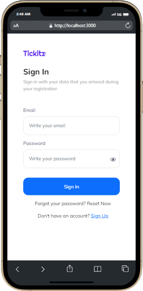

<div align="center">


<p align="center">Bioscoopkaartjes is one of my project about cinema online ticketing. It will help you on ordering ticket and saving your time.</p>

<br/>

[](https://reactjs.org/)
[](https://getbootstrap.com/docs/5.0/getting-started/introduction/)
[](https://www.npmjs.com/package/axios)
[](https://www.npmjs.com/package/react-paginate)
[](https://react-redux.js.org/)
[](https://www.npmjs.com/package/redux-persist)

[**Instalation**](#instalation) | [**Deployment**](#deployment) | [**Preview**](#preview)

<hr/>
</div>

<br/>

## Installation

1. Clone repo

   ```git
   https://github.com/erikasempana/bioscoopkaartjes_Frontend_react.git
   ```

2. Install Depedencies

   ```
   npm install
   ```

   <br/>

## API

- link to github: [github](https://github.com/erikasempana/bioscoopkaartjes_Backend.git)
- API-Bioscoopkaartjes : "https://bioscoopkaartjes.herokuapp.com/"

## Deployment

- integrate deployment [Here](https://bioscoopkaartjes.vercel.app/home)

<br/>

## Preview

This is how the website look like:

<p align="center">


</p>

<br/>

<p align="center">


</p>

<br/>

<p align="center">


</p>

<br/>

<p align="center">


</p>

<br/>

<p align="center">


</p>
